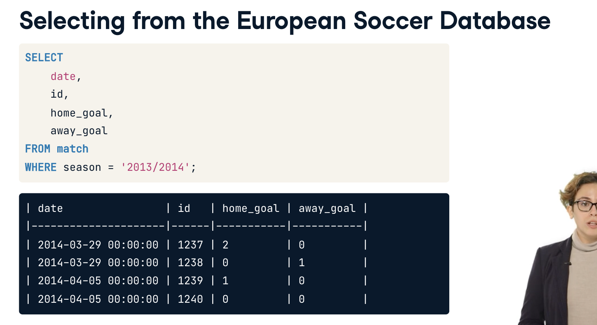

# [Intermediate SQL](https://app.datacamp.com/learn/courses/intermediate-sql)

# 1 We'll take the CASE

## We'll take the CASE

## Basic CASE statements

## CASE statements comparing column values

## CASE statements comparing two column values part 2

## In CASE things get more complex

## In CASE of rivalry

## Filtering your CASE statement

## CASE WHEN with aggregate functions

## COUNT using CASE WHEN

## COUNT and CASE WHEN with multiple conditions

## Calculating percent with CASE and AVG

# 2 Short and Simple Subqueries

## VIEW CHAPTER DETAILS

# 3 Correlated Queries, Nested Queries, and Common Table Expressions

## Correlated subqueries

## Basic Correlated Subqueries

## Correlated subquery with multiple conditions

## Nested subqueries

## Nested simple subqueries

## Nest a subquery in FROM

## Common Table Expressions

## Clean up with CTEs

## Organizing with CTEs

## CTEs with nested subqueries

## Deciding on techniques to use

## Get team names with a subquery

## Get team names with correlated subqueries

## Get team names with CTEs

## Which technique to use?

# 4 Window Functions

## You will learn about window functions and how to pass aggregate functions along a dataset. You will also learn how to calculate running totals and partitioned averages.

## It's OVER

## The match is OVER

## What's OVER here?

## Flip OVER your results

## OVER with a PARTITION

## PARTITION BY a column

## PARTITION BY multiple columns

## Sliding windows

## Slide to the left

## Slide to the right

## Bringing it all together

## Setting up the home team CTE

## Setting up the away team CTE

## Putting the CTEs together

## Add a window function

